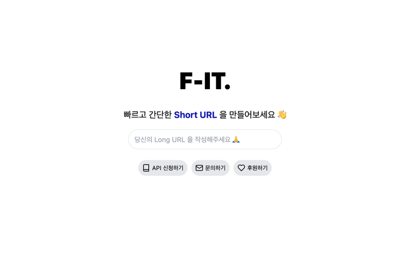

# Fit API

## ⭐️ 중점 사항
1. 빠르다 - GO의 언어적인 특성과 낮은 의존성으로 빠르게 구현
2. 가볍다 - Sqlite3 와 메모리 캐시를 사용해 최소한의 리소스로 최대 성능
3. 효율적이다 - 해시된 URL 로 중복 확인, ShortID 활용 등으로 효율 극대화

## 🚘 개요
Fit 서비스는 빠르고 정확하게 Short URL을 생성하고, 생성된 Short URL을 통해 원래 URL로 리다이렉트하는 API입니다.

## 🚀 기능
- Short URL 생성
- Short URL을 통한 리다이렉트
- Short URL 이동에 대한 결과를 웹훅으로 전송

### 🎉 생성 페이지

- 바로가기 : [https://f-it.kr](https://f-it.kr)




### 📔 API 목록

| Method |     Path      | Description |
|:---:|:-------------:|:---:|
| POST |   /v1/urls/   | Short URL 생성 |
| GET | /{short_key}/ | Short URL을 통한 리다이렉트 |

### 🔎 성능 비교 - 프레임워크

| 구분      | Python Django      | Python FastAPI | Golang Fiber        |
|---------|--------------------|---------------|---------------------|
| 언어 속도   | 2                  | 2             | 1                   |
| 프레임워크 속도 | 3                  | 2             | 1                   |
| 장점 요약  | 기본 구성 등            | 간단한 코드, 분산 처리 | 빠름, 간단한 코드, 분산 처리 등 |
| 단점 요약  | 느림, 기능에 비해 프로젝트가 큼 | 느림            | 언어적 제약(문서 등이 많이 없음) |

### 🔎 성능 비교 - ShortKey 생성
1. 호출할때 마다 랜덤한 ShortKey 생성 후 저장하는 방식

| 구분 | 설명                                                                                   |
| --- |--------------------------------------------------------------------------------------|
| 장점 | 간단하게 구현 가능<br/>별도의 상태 관리 값이 없어 스케일 아웃이 용이                                            |
| 단점 | 데이터가 많아지면 느려짐<br/>매번 ShortKey 존재 여부를 확인해야해서 느림<br/>ShortKey 를 저장하므로 상대적으로 많은 저장소를 차지함 |

2. 미리 랜덤한 ShortKey 를 생성해 놓고 매칭시키는 방식

| 구분 | 설명                                                                                                                                                |
| --- |---------------------------------------------------------------------------------------------------------------------------------------------------|
| 장점 | 미리 만들어 놓다보니 속도 저하 없음                                                                                                                              |
| 단점 | 미리 만들어 놓다보니 불필요한 저장소를 차지함<br/>모든 ShortKey 소진을 대비해 배치를 만들고 돌려야함<br/>ShortKey 를 저장하므로 상대적으로 많은 저장소를 차지함<br/>현재까지 만들어진 pk 값을 공통 관리하지 않으면 스케일 아웃이 불편함 |

3. **ShortKey 에 해당하는 Id 를 랜덤으로 생성하는 방식**

| 구분 | 설명                                                                                                                |
| --- |-------------------------------------------------------------------------------------------------------------------|
| 장점 | ShortKey 가 아닌 ShortId 를 저장하므로 적은 저장소를 차지함<br/>int 형으로 저장하다보니 조회/저장 속도가 빠름<br/>ShortId 를 조회하는 API 를 분리해 스케일 아웃에 용이 |
| 단점 | -                                                                                                                 |

### 🔑 ShortId 상세 설명

- 핵심 : **ShortKey 가 아닌 ShortId 를 사용한다**
- ShortId 란,
  - ShortKey 에 해당하는 Id
  - 다시 말해, ShortKey 를 a-zA-Z0-9 의 62개 문자를 사용해서 순차적으로 생성할 경우 거기에 해당하는 Id
- ShortId 규칙
    - ShortId 를 ShortKey 와 다른 순서로 규칙적이게 생성
    - 규칙적으로 생성되다보니 마지막으로 생성된 Id 만 알고 있으면 다음 Id 조회가 가능
    - 중복 생성되지 않다보니 데이터 저장시 존재 여부 확인할 필요 없음
- 단, 스케일 아웃을 위해선 마지막 Id 를 한 곳에서 관리해야함
- 그래서 별도의 API 로 분리해서 관리

## 🗄️ 설치
### 1. git clone
```bash
git clone https://github.com/lee-lou2/fit.git
```

### 2. .env 파일 생성
```bash
# .env
SHA256_SALT=
SENTRY_DSN=
SERVER_PORT=3000
```

### 3. build
```bash
go build
```

### 4. run
```bash
./fit
```

## 사용법
### 1. Short URL 생성
```bash
curl -X POST \
  http://localhost:3000/v1/urls/ \
  -H 'Content-Type: application/json' \
  -d '{
    "url": "https://www.google.com"
}'
```

### 2. Short URL을 통한 리다이렉트
브라우저에서 아래 URL로 접속

`http://localhost:3000/{short_key}`

## 📝 문의
- 이메일: lee@lou2.kr
